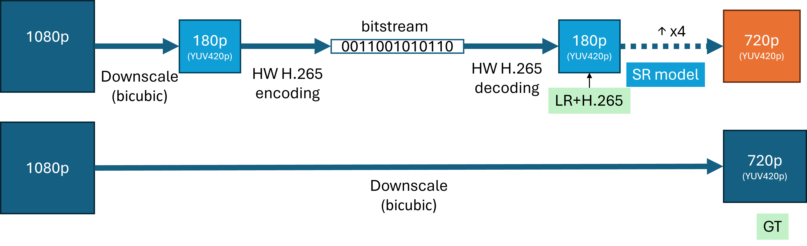

# Track 1: General Purpose Real-World Video Content

This track addresses Real-World Video Super Resolution without specifying a content type. The task involves x4 upscaling and removing compression artifacts from the input video. The model inputs are low-resolution (LR) videos encoded with H.265 using constant Quantization Parameters (QP). Models must not use future frames when upscaling and enhancing the current frame.

We provide training, validation, and test sets. Participants can also use other data for training their models; however, they should provide details in their paper. The training and validation sets are based on the [REDS dataset](https://seungjunnah.github.io/Datasets/reds.html) [1]. Besides 5 video clips, the rest of the original REDS validation set is included in the training set. The blind test set will be different and only be provided to registered teams one week before the challenge end dates. We used low-resolution videos (originally downscaled by bicubic) from REDS and encoded them with H.265. Figure 1 illustrates the process.

 
Figure 1: Data flow diagram for Track 1

Below are the links to the list of files in the training and validation sets for this track. Use the utility script, [downloader.py](../download/downloader.py), to download the files.

| Type | Train | Validation | Test |
| ---- | ----- | ---------- | ---- |
| Ground Truth | [train_gt](../download/links/track1_train_gt.txt) | [val_gt](../download/links/track1_val_gt.txt) | -- |
| Low Resolution + Compression | [train_lr_h265](../download/links/track1_train_lr_h265.txt) | [val_lr_h265](../download/links/track1_val_lr_h265.txt) | To be sent to registered teams* |

* Links for the test set will be sent to registered teams one week before the challenge ends.

## File Preparation

We used hardware encoding with H.265 in a low-power setting tailored to low-delay conferencing scenarios and constant QP. The training set includes QPs 17, 22, 27, 32, 34, and 37. The test set will include 4 QPs within this range. Provided files are finally encoded by libx264 with CRF 0, and YUV420p pixel format.

## File Naming

The following table describes the data path and file naming conventions:

| Format/Location | Description |
| ---- | ----- |
| `000_1280x720_24fps.mp4`   `000_1280x720_24fps_qp17.mp4` | `[video_id]_[width]x[height]_[fps]fps_qp[qp].mp4`   `_qp[qp]` is optional; when present, it means the video is compressed with H.265 with a constant QP of [qp] |
| `track1/train_gt/*`   `track1/val_gt/*` | Contains the ground truth real videos in 720p resolution |
| `track1/train_lr_H265/*`   `track1/val_lr_H265/*` | Contains the LR+H.265 videos in 180p resolution |

## Reference

1. Nah, S., Baik, S., Hong, S., Moon, G., Son, S., Timofte, R., & Mu Lee, K. (2019). ["NTIRE 2019 Challenge on Video Deblurring and Super-Resolution: Dataset and Study."](https://seungjunnah.github.io/Datasets/reds.html) *In Proceedings of the IEEE/CVF Conference on Computer Vision and Pattern Recognition Workshops* (pp. 0-0).
