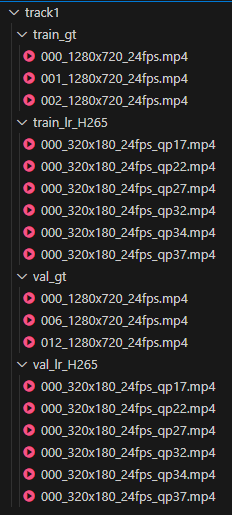

# Track 2: Talking Head Videos

This track addresses Real-world Video Super Resolution for Talking Head content. The task involves x4 upscaling and removing compression artifacts from the input video. The videos are from real-world scenarios where other artifacts may have been included in the original recording. The model inputs are low-resolution (LR) videos encoded with H.265 using constant Quantization Parameters (QP). Models must not use future frames when upscaling and enhancing the current frame.

We provide training, validation, and test sets. Participants can also use other data for training their models; however, they should provide details in their paper. The training and validation sets are an extension of the [VCD dataset](https://github.com/microsoft/VCD) and **may include landscape or portrait videos**. The blind test set will only be provided to registered teams one week before the challenge end date. Figure 2 illustrates the data preparation process, and Figure 3 presents thumbnail images from a portion of the training set.

 
Figure 2: Data flow diagram for Track 2 

 
Figure 3: Thumbnail images of Track 2’s training set.

Below are the links to the list of files in the training and validation sets for this track. Use the utility script, [downloader.py](../download/downloader.py), to download the files.

| Type | Train | Validation | Test |
| ---- | ----- | ---------- | ----- |
| Ground Truth | [train_gt](../download/links/track2_train_gt.txt) | [val_gt](../download/links/track2_val_gt.txt) | -- |
| Low resolution + compression | [train_lr_h265](../download/links/track2_train_lr_h265.txt) | [val_lr_h265](../download/links/track2_val_lr_h265.txt) | To be sent to registered teams* |

* Links for the test set will be sent to registered teams one week before the challenge ends.

## File Preparation

We used hardware encoding with H.265 in a low-power setting tailored to low-delay conferencing scenarios and constant QP. The training set includes QPs 17, 22, 27, 32, 34, and 37. The test set will include 4 QPs within this range. Each clip in the training set contains 100 frames, whereas the clips in the validation and test sets contain 300 frames. Provided files are finally encoded by libx264 with CRF 0 and YUV420p pixel format.

## File Naming

The following table describes the data path and file naming conventions:

| Format/Location | Description |
| ---- | ----- | 
| `000_1920x1080_30fps.mp4`   `000_480x270_30fps_qp17.mp4` | `[video_id]_[width]x[height]_[fps]fps_qp[qp].mp4`   `_qp[qp]` is optional; when present, it means the video is compressed with H.265 with a constant QP of [qp] |
| `track2/train_gt/*`   `track2/val_gt/*` | Contains the ground truth real videos in 1080p resolution |
| `track2/train_lr_H265/*`   `track2/val_lr_H265/*` | Contains the LR+H.265 videos in 270p resolution |

The directory structure is similar to Track 1:

## Reference

2. Naderi, B., Cutler, R., Khongbantabam, N. S., Hosseinkashi, Y., Turbell, H., Sadovnikov, A., & Zou, Q. (2024, April). [VCD: A Video Conferencing Dataset for Video Compression.](https://github.com/microsoft/VCD) *In ICASSP 2024-2024 IEEE International Conference on Acoustics, Speech and Signal Processing (ICASSP)* (pp. 3970-3974). IEEE.
