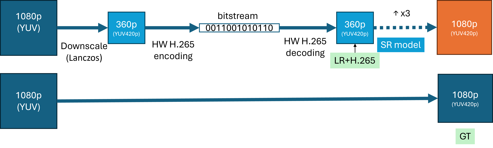

# Track 3: Screen Sharing Videos

This track addresses Video Super Resolution for screen sharing content. The task involves **x3 upscaling** and removing compression artifacts from the input video. The videos are recorded from different productivity applications where relevant tasks are being performed. The model inputs are low-resolution (LR) videos encoded with H.265 using constant Quantization Parameters (QP). Models must not use future frames when upscaling and enhancing the current frame.

We provide training, validation, and test sets. Participants can also use other data for training their models; however, they should provide details in their paper. The blind test set will only be provided to registered teams one week before the challenge end date. For this particular track, the challenge metric will be a combination of Subjective Mean Opinion Score (MOS) and Word Accuracy Rate determined by applying OCR on multiple sections of specific frames in the test set. Figure 4 illustrates the data preparation process, and Figure 5 presents thumbnail images from a portion of the training set.

 
Figure 4: Data flow diagram for Track 3

 
Figure 5: Thumbnail images of the Track 3 training set.

Below are the links to the list of files in the training and validation sets for this track. Use the utility script, [downloader.py](../download/downloader.py), to download the files.

| Type | Train | Validation | Test |
| ---- | ----- | ---------- | ---- |
| Ground Truth | train_gt | [val_gt](../download/links/track3_val_gt.txt) | -- |
| Low resolution + compression | train_lr_h265 | [val_lr_h265](../download/links/track3_val_lr_h265.txt) | To be sent to registered teams* |

* Links for the test set will be sent to registered teams one week before the challenge ends.

## File Preparation

We used hardware encoding with H.265 in a low-power setting tailored to low-delay conferencing scenarios and constant QP. The training set includes QPs 17, 22, 27, 32, 34, and 37. The test set will include 4 QPs within this range. Each clip in the training set contains 100 frames, whereas the clips in the validation and test sets contain 300 frames. Provided files are finally encoded by libx264 with CRF 0 and YUV420p pixel format.

## File Naming

The following table describes the data path and file naming conventions:

| Format/Location | Description |
| ---- | ----- |
| `0000_1920x1080_30fps.mp4`   `0000_640x360_30fps_qp17.mp4` | `[video_id]_[width]x[height]_[fps]fps_qp[qp].mp4`   `_qp[qp]` is optional; when present, it means the video is compressed with H.265 with a constant QP of [qp] |
| `track3/train_gt/*`   `track3/val_gt/*` | Contains the ground truth screen recordings in 1080p resolution |
| `track3/train_lr_H265/*`   `track3/val_lr_H265/*` | Contains the LR+H.265 videos in 360p resolution |

The directory structure is similar to Track 1:

